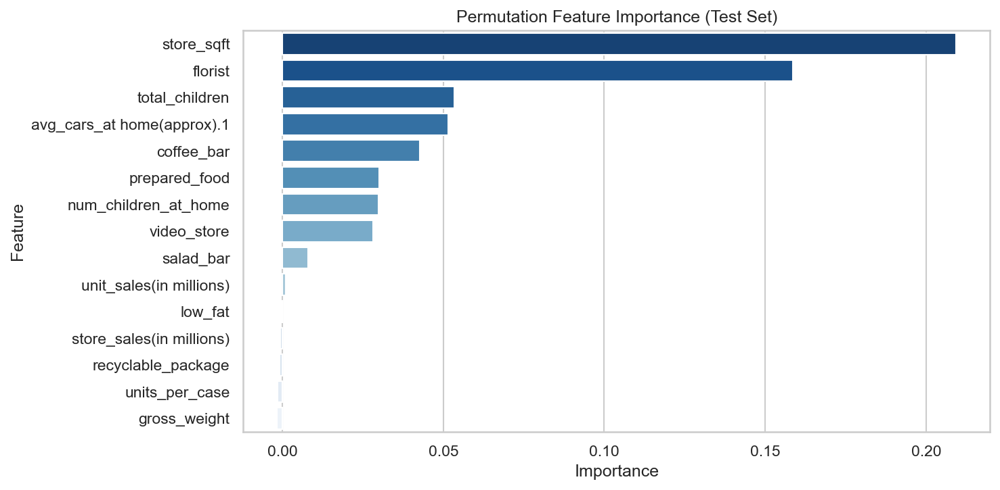

# Optimized Retail Cost Prediction Using Feature Engineering and Ensemble Learning

> Predicting product cost from retail attributes using ensemble machine learning on 360K+ records.

---

## Overview

Retail pricing is influenced by a complex mix of store characteristics, product attributes, and sales patterns. This project builds a regression pipeline to predict the numerical target `cost` from those features.

**Approach:** After exploratory analysis revealed near-zero linear correlations between features and the target, tree-based ensemble models were selected over linear alternatives. A `HistGradientBoostingRegressor` was trained as the primary model, with a `RandomForestRegressor` serving as a baseline for comparison.

**Goal:** Produce accurate, generalizable cost predictions while keeping the pipeline clean, interpretable, and reproducible.

---

## 🏆 Achievement

Ranked 3rd out of 160 participants in a course (Machine Learning for Data Science) competition, driven by effective feature engineering and a tuned ensemble of gradient boosting models.

---

## Results

| Model | R² | MAE | RMSE |
|---|---|---|---|
| RandomForestRegressor (baseline) | — | — | — |
| GradientBoostingRegressor | — | — | — |
| HistGradientBoostingRegressor | — | — | — |
| VotingEnsemble (RF + GBR + HGB) | — | — | — |

*Fill in after running the notebook.*

---

## Visual Results

Actual vs Predicted            |  Feature Importance
:-----------------------------:|:-----------------------------:
 | 

*Generated automatically when you run the notebook.*

---

## Dataset

| File | Description |
|------|-------------|
| `Dataset/train.csv` | 360,336 rows — features + target (`cost`) |
| `Dataset/test.csv` | 240,224 rows — features only (for submission) |
| `Dataset/sample_submission.csv` | Expected output format |

**Features include:** store sales, unit sales, gross weight, store size, product attributes (low fat, recyclable), and store amenities (coffee bar, florist, etc.)

---

## Project Structure

```
├── Dataset/
│   ├── train.csv
│   ├── test.csv
│   └── sample_submission.csv
├── cost_prediction_gradient_boosting.ipynb
├── requirements.txt
└── README.md
```

---

## Workflow

1. Imports & Configuration
2. Data Loading & Inspection
3. Exploratory Data Analysis (EDA)
4. Preprocessing & Feature Engineering
5. Train / Validation / Test Split — 70 / 15 / 15
6. Model Training (baseline + primary)
7. Evaluation on Held-Out Test Set
8. Feature Importance via Permutation Importance
9. Generate Submission Predictions

---

## Model

**Baseline: `RandomForestRegressor`** — bagging ensemble; 100 trees averaging independent predictions to reduce variance.

**Boosting: `GradientBoostingRegressor`** — classic sequential boosting; each tree corrects the residuals of the previous. More interpretable tuning knobs (`subsample`, `max_depth`) but slower on large data.

**Primary: `HistGradientBoostingRegressor`** — histogram-based boosting (inspired by LightGBM). Significantly faster than standard GBR on 360K+ rows, natively handles missing values, and consistently delivers strong R² with minimal preprocessing.

**Ensemble: `VotingRegressor`** — averages predictions from all three models. Reduces variance and often edges out any single model by combining their complementary strengths.

Linear models (Lasso, Ridge) were ruled out early — EDA showed near-zero Pearson correlations between all features and `cost`, meaning the relationships are non-linear and require tree-based approaches.

---

## Key Design Decisions

| Decision | Reasoning |
|---|---|
| Dropped `id` column | Non-predictive identifier |
| Log transform on `num_children_at_home` | Skew ~1.85; all other features had \|skew\| < 1 |
| No transform on target `cost` | Near-symmetric distribution (skew ~0.02) |
| Hyperparameter tuning commented out | Uncomment `RandomizedSearchCV` cell to run |

---

## Evaluation Metrics

| Metric | What it measures |
|--------|-----------------|
| R² | Proportion of variance explained by the model |
| MAE | Average absolute prediction error |
| RMSE | Error magnitude, penalizing large mistakes more heavily |

---

## Skills Demonstrated

- Exploratory Data Analysis (EDA) & distribution analysis
- Feature engineering & selective log transformation
- Regression modeling with boosting algorithms (GBR, HistGBM)
- Ensemble learning — bagging (Random Forest) + boosting + voting ensemble
- Baseline vs. primary model comparison across 4 models
- Permutation-based feature importance interpretation
- Clean, reproducible ML pipeline in a Jupyter notebook

---

## How to Run

```bash
# Install dependencies
pip install -r requirements.txt

# Launch the notebook
jupyter notebook cost_prediction_gradient_boosting.ipynb
```

Run all cells top to bottom. To enable hyperparameter tuning, uncomment the `RandomizedSearchCV` cell in section 6.

---

## Potential Improvements

- Try `LightGBM` or `XGBoost` for additional performance comparison
- Add k-fold cross-validation for more robust evaluation
- Engineer interaction features (e.g., `store_sqft × store_sales`)
- Use SHAP values for deeper model explainability
